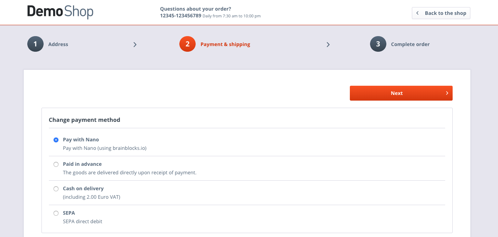

# LdRaiblocksIntegration

This plugin is now maintained under the official [Brainblocks Github account](https://github.com/brainblocks/LdRaiblocksIntegration)

## Description
Shopware plugin for accepting [Raiblocks](https://raiblocks.net/) payments via [BrainBlocks](https://brainblocks.io).

## Screenshots

   
   

## Setup

1. Download Plugin [here](https://github.com/LucaDe/LdRaiblocksIntegration/releases/download/1.0/LdRaiblocksIntegration.zip).
2. Upload the zip file via your plugin manager in your shopware installation
3. Install and activate the plugin 
3. Set your xrb destination address in the plugin's configuration
4. Enable the new payment option 'Pay with Raiblocks' in the 'Payment methods' module.
   
5. That's it! You can configure the default texts via the 'Payment methods' and 'Snippets' module. 
 
## License

The MIT License (MIT). Please see [License File](LICENSE) for more information.
